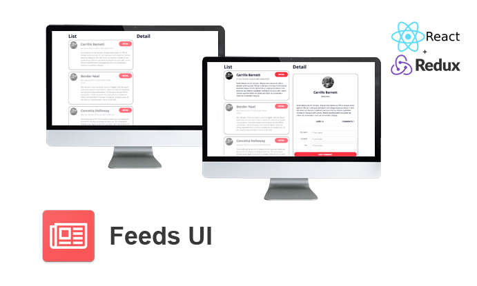

# Feeds UI



The Feeds UI is an application that provides an implementation of a UI for blog feeds.

## Requirements

* Npm / Yarn
* Node.JS
* React.JS
* Redux
* Sass

## Installation

* Install `npm install yarn`
* Install all necessary npm packages `yarn`

## Run application

* `yarn run start`

## Run application - build

* `yarn run build`

## Libraries

 * [Node.JS](https://nodejs.org/en/) - Node.js JavaScript runtime
 * [React](https://reactjs.org) - React is a JavaScript library for building user interfaces
 * [React-bootstrap](https://github.com/react-bootstrap/react-bootstrap) - Bootstrap 3 components built with React
 * [React-redux](https://github.com/reactjs/react-redux) - Official React bindings for Redux
 * [Axios](https://github.com/axios/axios) - Promise based HTTP client for the browser and node.js
 * [Immutable](https://github.com/facebook/immutable-js) - Immutable Data Collections
 * [PropTypes](https://github.com/developit/proptypes) - Runtime type checking for React props and similar objects
 * [Moment](https://github.com/moment/moment) - Parse, validate, manipulate, and display dates
 * [Gulp](https://gulpjs.com/) - The streaming build system
 * [Node-sass](https://github.com/sass/node-sass) - Node.js bindings to libsass

# License - Apache License, Version 2.0

```
# (C) Copyright 2017 by Marek Hakala <hakala.marek@gmail.com>
# Licensed under the Apache License, Version 2.0 (the "License");
# you may not use this file except in compliance with the License.
# You may obtain a copy of the License at
#
# http://www.apache.org/licenses/LICENSE-2.0
#
# Unless required by applicable law or agreed to in writing, software
# distributed under the License is distributed on an "AS IS" BASIS,
# WITHOUT WARRANTIES OR CONDITIONS OF ANY KIND, either express or implied.
# See the License for the specific language governing permissions and
#    limitations under the License.
```
